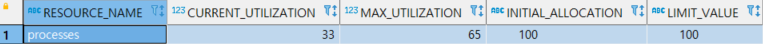

# 2022-02-09 조민수

<details>
<summary>1. 비즈플레이 배치가 돌던 중 ORA-12519 에러 발생</summary>

```log
Error updating database.
Cause: org.springframework.jdbc.CannotGetJdbcConnectionException:
Could not get JDBC Connection; nested exception is java.sql.SQLException:
Listener refused the connection with the following error:
ORA-12519, TNS:no appropriate service handler found
```

##### 사유 : 오라클이 처리하는 프로세스의 수가 적게 설정되어 발생

<br>

##### 해결 : 오라클의 프로세스 수 증가

- 프로세스 수량 확인

```sql
SELECT * FROM V$RESOURCE_LIMIT WHERE RESOURCE_NAME = 'processes';
```


<br>

- 프로세스 수량 증가(100 -> 300)

```sql
ALTER SYSTEM SET PROCESSES=300 SCOPE=SPFILE;
```

<br>

- 오라클 재실행

```bash
docker restart oracle
```

</details>

<br>

<details>
<summary>2. 비즈플레이 배치가 돌던 중 ORA-12899 에러 발생</summary>

```log
java.sql.SQLException:
ORA-12899: value too large for column "LETECH"."BP_0411A"."APPR_CONT" (actual: 1110, maximum: 1000)
```

##### 사유 : 비즈플레이 API의 컬럼정의서에 APPR_CONT는 VARCHAR2(1000)으로 되어 있었으나 실제 수신받은 데이터는 이를 초과하여 에러 발생 

<br>

##### 해결 : 컬럼의 사이즈 증가

- 프로세스 수량 증가(1000 -> 2000)

```sql
ALTER TABLE BP_0411A MODIFY (APPR_CONT VARCHAR2(2000));
```

</details>

---